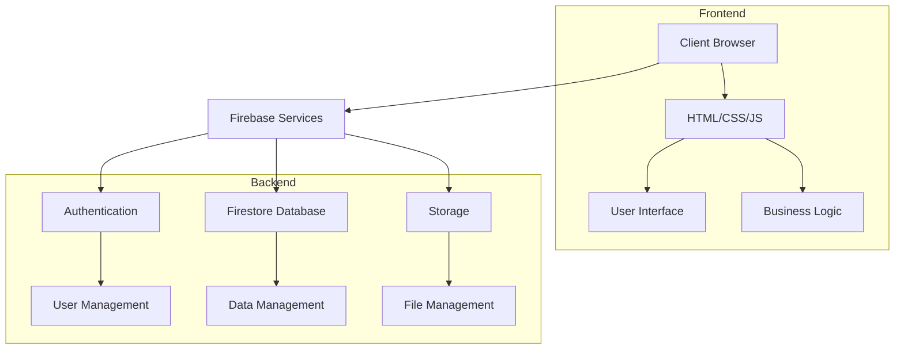
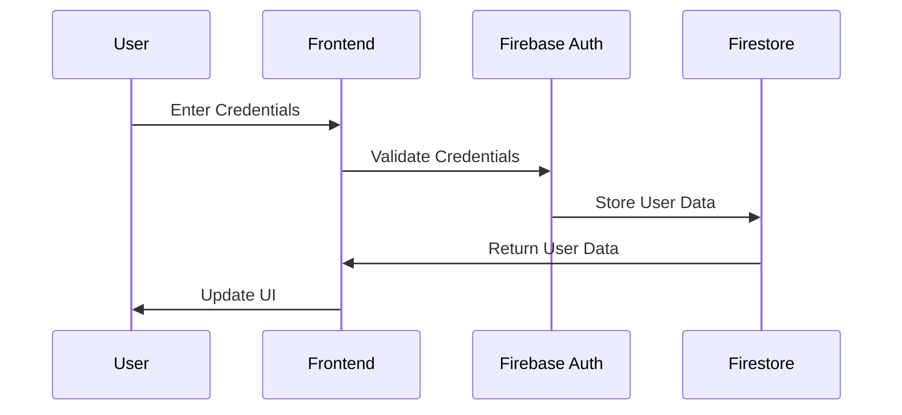
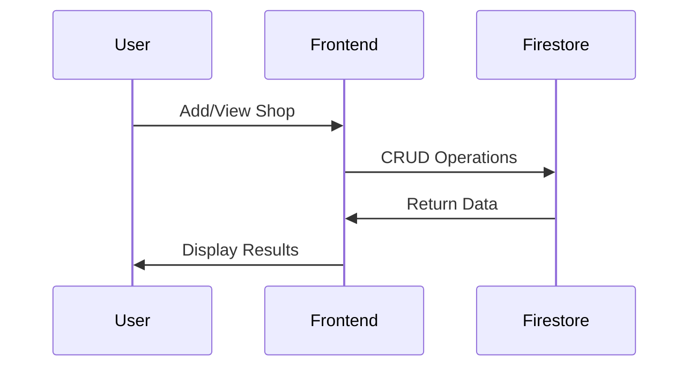

# Super Mall - System Architecture Document

## 1. High-Level Architecture



## 2. Component Architecture

### 2.1 Frontend Components
```
Frontend
├── User Interface Layer
│   ├── Navigation
│   ├── Authentication Forms
│   ├── Shop Management
│   └── Offer Management
│
├── Business Logic Layer
│   ├── Authentication Module
│   ├── Shop Module
│   ├── Offer Module
│   └── Logger Module
│
└── Data Access Layer
    ├── Firebase Config
    ├── Database Operations
    └── Storage Operations
```

### 2.2 Backend Components
```
Backend (Firebase)
├── Authentication Service
│   ├── User Registration
│   ├── User Login
│   └── Session Management
│
├── Firestore Database
│   ├── Users Collection
│   ├── Shops Collection
│   ├── Offers Collection
│   ├── Categories Collection
│   └── Floors Collection
│
└── Storage Service
    ├── Shop Images
    └── Offer Images
```

## 3. Data Flow Architecture

### 3.1 Authentication Flow


### 3.2 Shop Management Flow


## 4. Security Architecture

### 4.1 Authentication Security
- Email/Password Authentication
- Session Management
- Token-based Authorization

### 4.2 Data Security
- Firestore Security Rules
- Data Encryption
- Access Control Lists

## 5. Scalability Architecture

### 5.1 Horizontal Scaling
- Firebase Auto-scaling
- Load Balancing
- CDN Integration

### 5.2 Vertical Scaling
- Database Indexing
- Query Optimization
- Caching Strategies

## 6. Integration Architecture

### 6.1 External Services
- Firebase Services Integration
- Third-party APIs (Future)
- Payment Gateways (Future)

### 6.2 Internal Services
- Module Communication
- Event Handling
- State Management 